# 🧑‍⚕️ InPaciente: Gerenciador de Clínicas Médicas - API

[InPaciente](https://inpaciente.vercel.app/) é uma aplicação web idealizada e desenvolvida por mim. Sua motivação é auxiliar no processo de administração de clínicas médicas, facilitando o processo de agendamento de consultas e documentação de dados pessoais de pacientes e médicos.

O repositório do Front pode ser acessado através [deste](https://github.com/ullyanne/InPacienteWeb) link.

## 💻️ Tecnologias utilizadas

No backend, utilizei o framework Fastify para Node.js com Typescript, Prisma ORM e PostgreSQL aliado ao Docker para o banco de dados. Para a validação, usei a biblioteca Zod. Já para a [documentação](https://inpacienteapi-production.up.railway.app/docs) da API, foi utilizada a ferramenta Swagger.

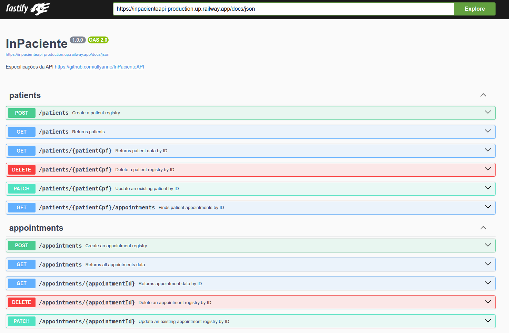

No frontend, utilizei React com Typescript, Tailwind para estilização, aleḿ de alguns componentes da biblioteca Radix. Para criação das tabelas, utilizei a biblioteca TanStack. Já para a criação dos formulários, React Hook Form e Zod.

## 🧑‍🦳 Pacientes

Sua página principal possui uma tabela que contém os dados de cada indivíduo: nome, endereço, CPF e número de telefone, como também uma barra de busca para filtrar os resultados. Além disso, algumas colunas da tabela possuem a opção de ordenação alfabética. **Todos os dados apresentados são fictícios**.

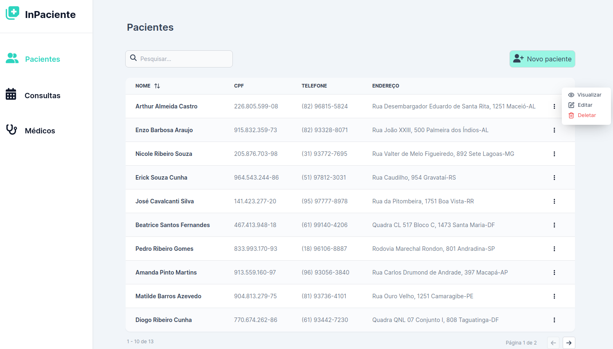

Em cada linha da tabela, é possível acessar o dropdown à direita para visualizar detalhes do registro do paciente. Nessa página de detalhes, além dos dados pessoais, podem ser vistas suas próximas consultas de acordo com a data atual, junto com seus respectivos horário, data, médico e especialidade.

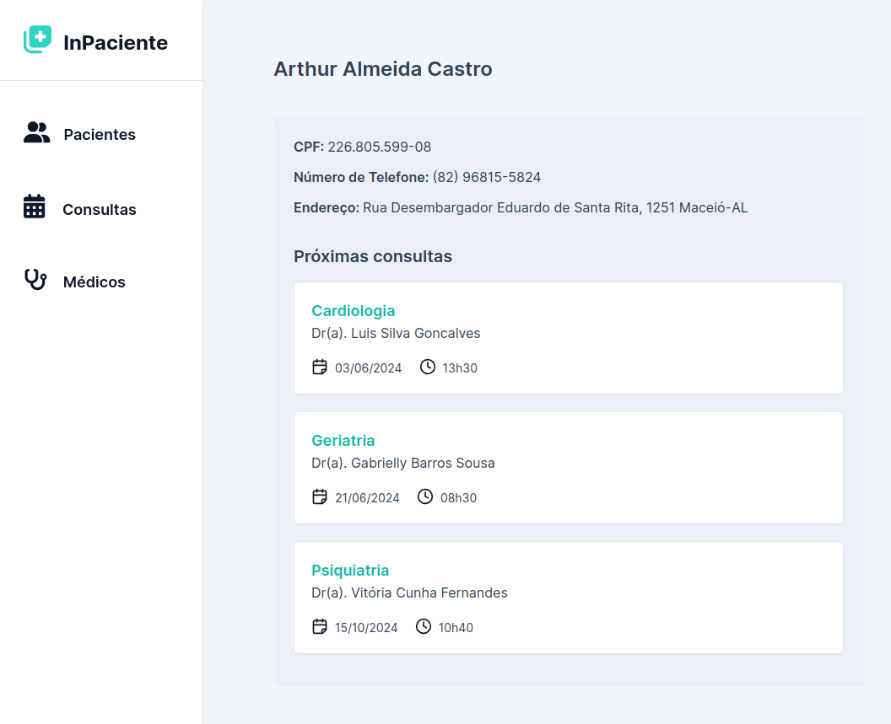

Além disso, é possível acessar a opção de atualizar os dados cadastrais mutáveis do paciente: número de telefone e endereço, que pode ser visualizada na figura abaixo.

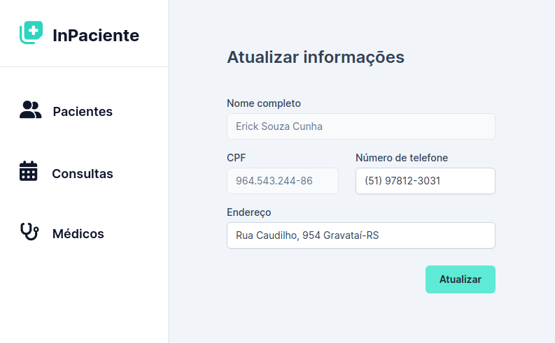

Também é possível acessar a opção de exclusão do registro do paciente da base de dados.

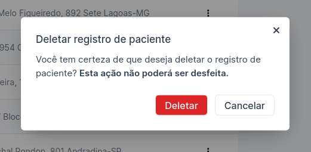

Na parte superior da página principal, pode-se acessar a página de criação de novos registros de paciente através do botão "Novo Paciente". São aceitos apenas CPFs válidos e não é possível criar mais de um registro com o mesmo CPF.

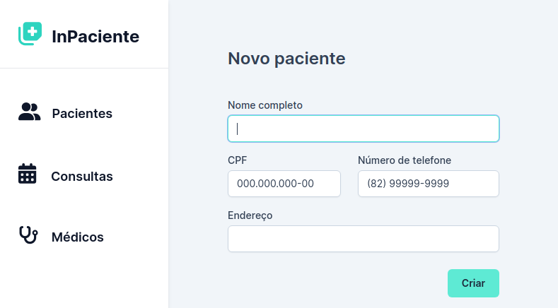

## 🏥 Consultas

Na página inicial, é possível visualizar uma barra de busca e uma tabela contendo informações pertinentes às consultas: nome do médico, especialidade, nome do paciente e data. Como na página de pacientes, há também um dropdown presente ao lado de cada registro para realizar ações de atualização e exclusão.

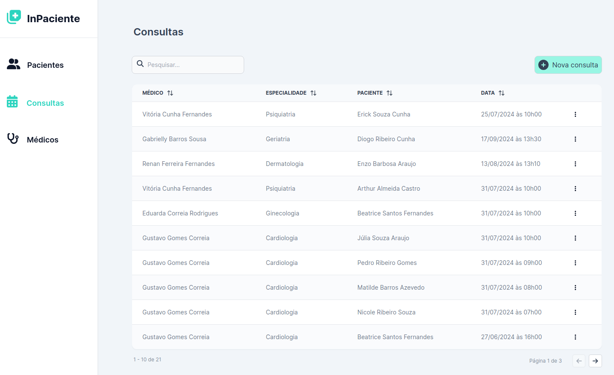

O preview da página de edição pode ser visualizado na figura abaixo.

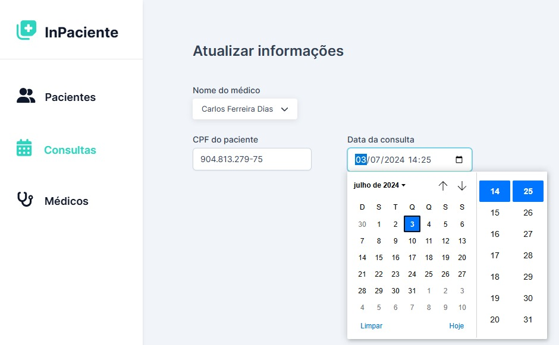

Além disso, é possível acessar a página de agendamento de novas consultas. Nela, é solicitado o nome do médico, apresentando uma lista com todos os médicos cadastrados, o CPF do paciente e a data e horário da consulta. Ela pode ser visualizada na figura abaixo.

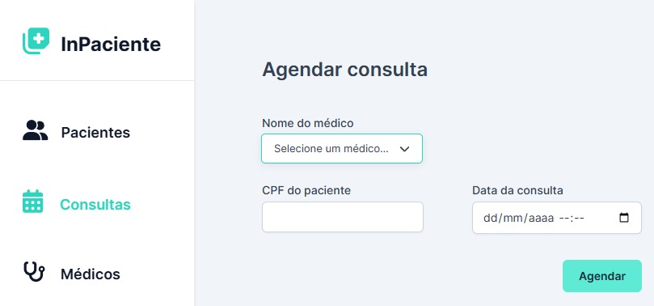

## 🧑‍⚕️ Médicos

Semelhantemente às demais páginas, a página principal contém uma tabela que contém informações importantes sobre cada médico cadastrado: nome, especialidade e CRM.

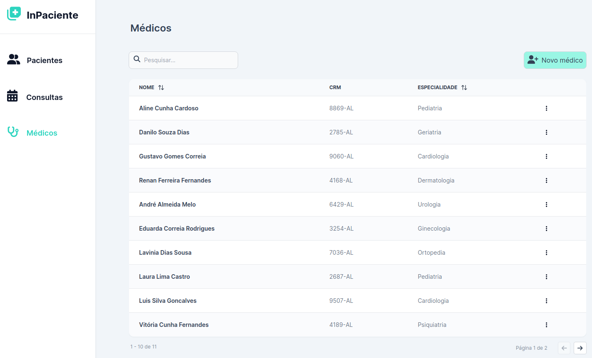

A página de criação de novos médicos pode ser visualizada abaixo.

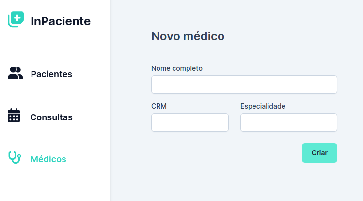

E por fim, a de edição.

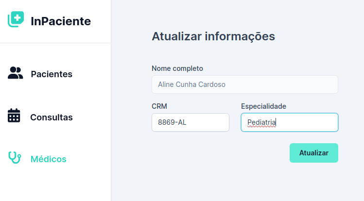